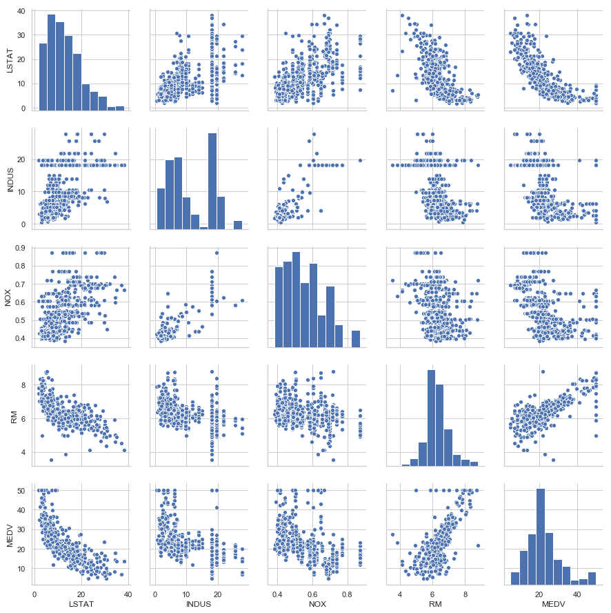
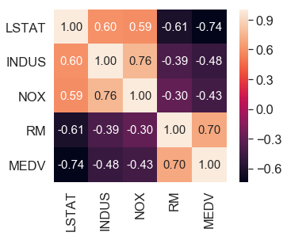
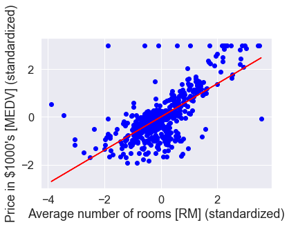

# Linear Regression: Template Notebooks

Stuart Truax, 2019-8

These notebooks illustrate the basic components of creating and evaluating
linear regression models using `python` and `scikit-learn`. The notebooks
cover:

 - __Ordinary Least Squares using Gradient Descent__
 - __Randomized Sample Consensus (RANSAC)__
 - __Cross-Validation__
 - __Residuals__
 - __LASSO, Ridge, and ElasticNet Regularization__

All notebooks are annotated with mathematical descriptions of the models and
methods being applied. All notebooks use the same include input data. The examples
are derived with modification from [1].

# Contents

 - `OLS.ipynb` - Ordinary Least Squares regression with a custom function.
                 EDA, standardization, and plotting covered.

 - `scikit-learn_LinearRegression.ipynb` - Linear regression using the `scikit-learn` library.

 - `Model_Evaluation.ipynb` - Model evaluation through cross-validation, mean-squared error (MSE),
                              and calculation of residuals.

 - `RANSAC.ipynb` - Using Randomized Sample Consensus (RANSAC) to deal with outliers.

 - `Regularization_Methods_in_Linear_Regression.ipynb` - Application and comparison
                   of the LASSO, Ridge, and ElasticNet Regularization methods to
                  linear regression.                         

 - `housing.data` -  Housing dataset of D. Harrison and D.L. Rubinfield, 1978.
                     Available from   https://archive.ics.uci.edu/ml/datasets/Housing.

## Example Analysis Outputs

### Scatterplot Matrices

### Correlation Matrices

### Regressions

### References

[1] S. Raschka, *Python Machine Learning*. Birmingham, UK: Packt Publishing, 2015.
